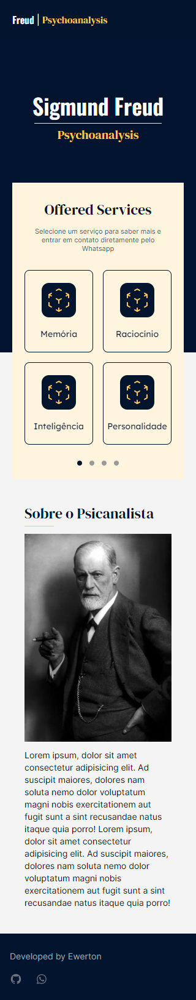

# 🚧 Documentation under construction 🚧

## Hello

This is the basis of a Django+Postgres+Next.js private project. You can use for building you own app. Give a look above for more details.

### Railway + Vercel

I deployed the Next.js website on a Vercel server. You can access [here][vercel]. 

I deployed the Django+Postgres on a Railway server. You can access the API [here][railway]. The Github repository can be found [here][django-repo].

### Interface 

This is the version 1.0.

[django-repo]: https://github.com/Ewerton12F/teste-server
[next-repo]: https://github.com/Ewerton12F/test-website
[railway]: https://teste-server-production.up.railway.app/api/services-list
[vercel]: https://test-website-ewerton12F.vercel.app/